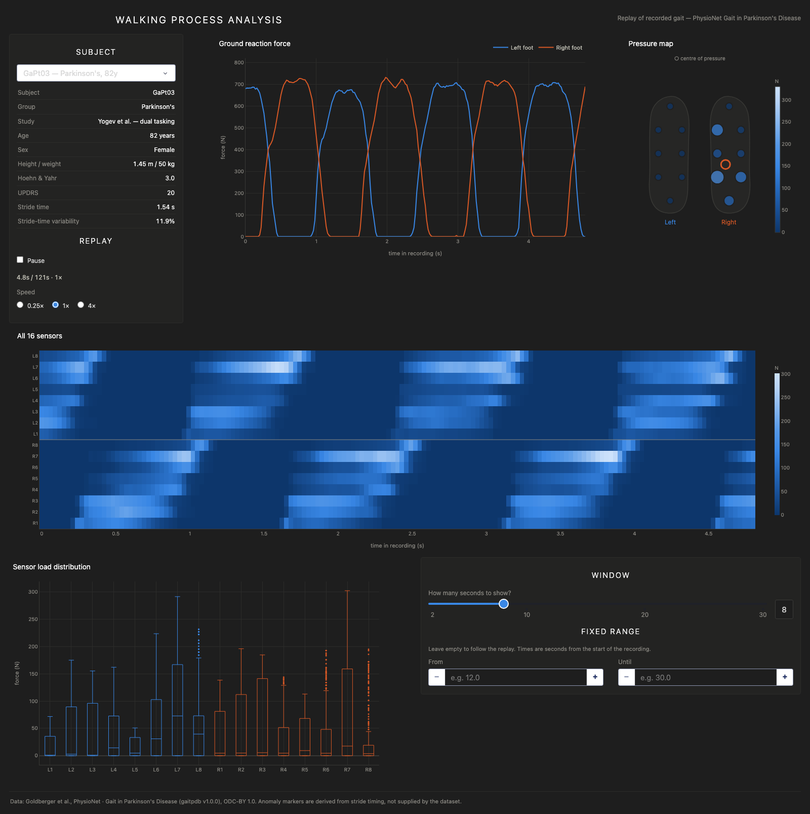

# Walking Process Analysis — foot pressure dashboard

A live dashboard for foot-pressure gait data, built with [Plotly Dash](https://dash.plotly.com/).
It shows the walking rhythm, all sixteen sensor channels, an anatomical pressure
map and per-sensor load distributions, updating continuously as a recording
plays back.



## What changed, and why

The original version of this project read a mock service at
`tesla.iem.pw.edu.pl:9080`, reachable only from the Warsaw University of
Technology VPN. That access is gone, and the app could not start without it.
It now runs on a real, openly licensed dataset and on a current Dash release:

- **Data**: the PhysioNet *Gait in Parkinson's Disease* database replaces the
  mock feed — 8 force sensors under each foot at 100 Hz, with demographics.
- **Framework**: Dash 1.12 → Dash 4. `dash_core_components`, `dash_html_components`
  and `Dash.run_server` were all removed in Dash 3, so every import and the entry
  point changed.
- **Transport**: `dcc.Interval` polling → Dash 4 **WebSocket push**. The server
  streams frames down a persistent connection instead of the browser asking for
  them once a second.
- **Sensors**: the old UI showed 6 sensors (3 per foot) against a static image.
  All 16 real channels are now used, and the image is replaced by a generated
  pressure map drawn at the dataset's own sensor coordinates.

## The dataset

[**Gait in Parkinson's Disease**](https://physionet.org/content/gaitpdb/1.0.0/)
(`gaitpdb` v1.0.0) — 93 patients with Parkinson's disease and 73 healthy
controls, from three studies by Yogev, Hausdorff and Frenkel-Toledo. Each
recording carries the vertical ground reaction force on 8 sensors per foot at
100 Hz for about two minutes, plus each foot's total force.

Released under the **Open Data Commons Attribution License v1.0**. Cite:

> Goldberger A., Amaral L., Glass L., Hausdorff J., Ivanov P. C., Mark R.,
> Mietus J. E., Moody G. B., Peng C. K., Stanley H. E. (2000). PhysioBank,
> PhysioToolkit, and PhysioNet: Components of a new research resource for
> complex physiologic signals. *Circulation* 101(23), e215–e220.
>
> Frenkel-Toledo S., Giladi N., Peretz C., Herman T., Gruendlinger L.,
> Hausdorff J. M. (2005). Treadmill walking as an external pacemaker to improve
> gait rhythm and stability in Parkinson's disease. *Movement Disorders* 20(9),
> 1109–1114.

The data is **not** committed to this repository; `fetch_data.py` downloads it.

## Setup

```bash
python -m venv .venv && source .venv/bin/activate
pip install -r requirements.txt

python fetch_data.py     # download + ingest (~7 MB, six subjects)
python app.py            # http://127.0.0.1:8050
```

`fetch_data.py` pulls three patients and three controls by default. Other
subjects:

```bash
python fetch_data.py --list                    # all 166 subjects
python fetch_data.py --subjects GaPt05,SiCo02  # fetch specific ones
```

It downloads from PhysioNet and falls back to their AWS Open Data mirror if the
main site is unreachable.

## How the live view works

The recordings are fixed-length files, so "live" is a **replay**: the app keeps a
virtual clock (`wall clock elapsed × replay speed`) and queries the window of
samples up to that point, looping at the end of the recording. Pausing freezes
the clock.

Nothing is written to the database while the app runs. The replay state lives in
the local variables of the streaming coroutine, which runs once per browser
connection:

```python
@app.callback(Input("stream-boot", "data"), persistent=True, websocket=True)
async def stream(_):
    ws = ctx.websocket
    while True:
        if ws is None or ws.is_shutdown:
            raise PreventUpdate          # the viewer closed the tab
        settings = await ws.get_prop("controls", "data")
        ...
        set_props("rhythm-plot", {"figure": figures.rhythm_figure(frame)})
        await asyncio.sleep(FRAME_INTERVAL)
```

This requires the FastAPI backend (`Dash(__name__, backend="fastapi")`), which
`pip install -r requirements.txt` provides via the `dash[fastapi]` extra.

## Anomaly markers

The old API supplied an `anomaly` flag with every reading. This dataset has
none, so the shaded bands are **derived**: a stride is flagged when it runs more
than 10% longer or shorter than that subject's median stride.

Stride-time variability is the measure this dataset exists to study, and it
separates the groups in the default selection — controls 3.4–6.1%, patients
11.2–19.1% — so the dashboard also reports it per subject.

The threshold is a fraction of the median rather than a multiple of the
subject's own spread, deliberately: a spread-relative threshold widens for
exactly the erratic walkers whose strides most deserve flagging.

## The panels

| Panel | Shows | Encoding |
|---|---|---|
| Ground reaction force | Total load under each foot — the gait cycle | two series: left / right |
| All 16 sensors | Every channel over time; the heel→toe wave | one hue, light = more force |
| Pressure map | Current load at the real sensor coordinates, plus each foot's centre of pressure | one hue + marker size |
| Sensor load distribution | Per-sensor spread across the window | position carries identity |

Sixteen sensors are deliberately never sixteen colours: the two feet are the
only categorical split, and everything encoding magnitude uses a single ramp.

## Layout

```
app.py         layout, callbacks, the streaming coroutine and virtual clock
gaitdata.py    download, parse, anomaly derivation, SQLite ingest and queries
figures.py     the four figure builders
fetch_data.py  CLI for downloading and ingesting
tests/         end-to-end browser checks
```

## Tests

The UI is driven entirely by WebSocket pushes, so the tests drive a real browser:

```bash
pip install -r requirements-dev.txt
playwright install chromium

python app.py                 # in one terminal
python -m pytest tests/ -q    # in another
```
