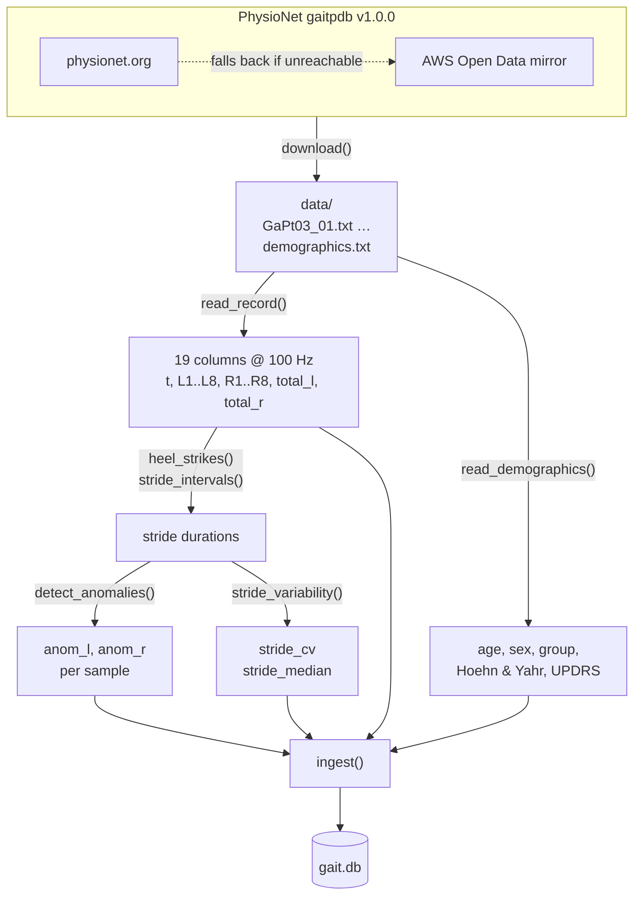
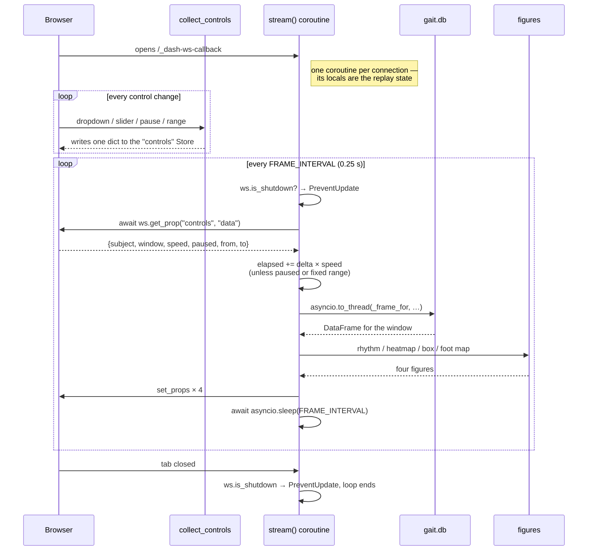
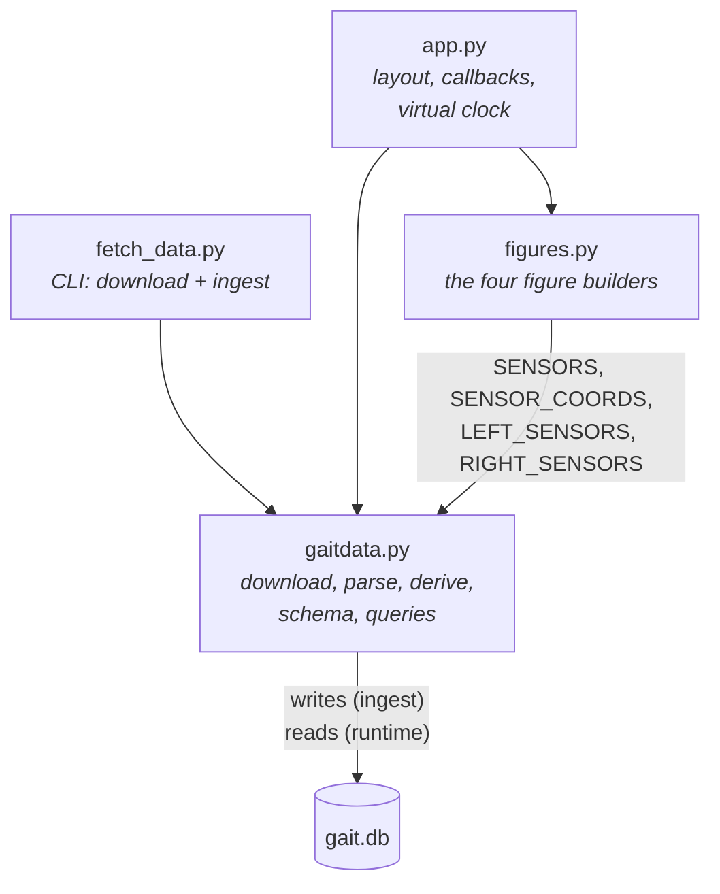

# Architecture

How data moves through this project, for anyone who needs to change it. For
setup and the dataset itself, see the [README](../README.md).

## The two phases

Data reaches the dashboard in two phases that never overlap:

1. **Ingest** — `fetch_data.py` downloads recordings, derives anomaly flags and
   per-subject statistics, and writes `gait.db`. Run once, offline.
2. **Runtime** — `app.py` opens the same database **read-only** and never writes
   to it. Every number on screen was already in `gait.db` before the server
   started.

Almost everything else follows from that split. In particular, the "live" view
is a replay driven by a clock, not by a process appending rows.

## Ingest pipeline



Everything expensive happens here, once: heel-strike detection, stride timing,
anomaly flags, and the per-subject summaries (`stride_cv`, `stride_median`,
`sensor_peak`). That is why the runtime loop can afford to rebuild four figures
several times a second — it only ever runs a range query.

`MIRRORS` in `gaitdata.py` holds the two sources. PhysioNet is canonical; the
AWS mirror is tried automatically when the site is unreachable, which is not
hypothetical — their TLS certificate has lapsed at least once.

## Storage

Two tables, defined by `SQL_CREATE_SUBJECTS` and `SQL_CREATE_TRACES` in
`gaitdata.py`.

### `subjects` — one row per subject

| Column | Source |
|---|---|
| `subject`, `study`, `grp`, `gender`, `age`, `height`, `weight` | published in `demographics.txt` |
| `hoehnyahr`, `updrs`, `updrsm`, `tuag` | published (clinical scores; patients only) |
| `duration`, `samples` | measured from the recording |
| `stride_cv`, `stride_median` | **derived** — stride-time variability and median stride |
| `sensor_peak` | **derived** — the recording's peak sensor value |

`sensor_peak` exists so the pressure map can fix its colour scale for a whole
recording. Without it the scale re-fits every frame and the same colour means a
different force from one push to the next.

### `traces` — one row per sample

```
subject, t, L1..L8, R1..R8, total_l, total_r, anom_l, anom_r
```

Indexed on `(subject, t)`. At 100 Hz a two-minute recording is about 12 000 rows.

`t` is **seconds from the start of the recording**, not a wall-clock timestamp.
That is deliberate: it makes the virtual clock an ordinary range query
(`WHERE subject = ? AND t <= ? AND t >= ?`) instead of arithmetic against a
session start time, and it means the same row means the same thing no matter
when or how often you replay it.

## Runtime data flow



Three things in there are worth reading twice.

**The server pulls the controls from the client.** `collect_controls` folds every
widget into a single `controls` Store on the browser side; the streaming
coroutine then reads it back with `await ws.get_prop(...)` once per frame. This
is the reverse of the usual Dash direction, and it is why changing the subject
does not restart the loop — the loop simply sees a different value on its next
tick.

**The database read is pushed to a thread.** `asyncio.to_thread(_frame_for, ...)`
keeps a blocking SQLite call off the connection's event loop, which the same
loop is using to serve every other callback on that connection.

**The loop must check `ws.is_shutdown`.** Without it the coroutine keeps building
figures for a browser that has gone away. This is the documented contract for
persistent Dash WebSocket callbacks, not an optimisation.

## Module ownership



- **`gaitdata.py`** owns everything about the data: where it comes from, how it
  parses, what counts as an anomaly, the schema, and every query. It knows
  nothing about Dash or plotting.
- **`figures.py`** owns how things look. It imports from `gaitdata` only the
  sensor names and coordinates, so it can be exercised on any DataFrame with the
  right columns.
- **`app.py`** owns the page and the clock. It holds no analysis logic.
- **`fetch_data.py`** is a thin CLI over `gaitdata.download` and `gaitdata.ingest`.

## Design notes

Four choices that look like mistakes until you know the reason.

1. **A virtual clock, not a writer thread.** The obvious way to fake a live feed
   is a background thread appending rows. That breaks here: `app.run()` on the
   FastAPI backend spawns `python -m uvicorn app:app.server` as a subprocess, so
   the module is imported in both the parent and the worker — and again per child
   under `debug=True`. A module-level writer would run two or three times against
   one database. Advancing a clock over already-ingested rows has no such
   failure mode, and it is reproducible.

2. **Replay state lives in coroutine locals.** `stream()` runs once per
   connection, so `elapsed`, `subject` and `last_tick` are already per-viewer —
   no session store, no ids, no cleanup. The trade-off is that state is
   per-*connection*: two tabs replay independently, and a reload starts over.
   For this dashboard that is the behaviour you want.

3. **All controls are folded into one Store.** Six separate `get_prop` calls per
   frame would be six round trips at 4 Hz. `collect_controls` makes it one.

4. **Anomalies are derived at ingest.** The service this dashboard originally
   read supplied an `anomaly` flag with every reading; this dataset has none. The
   flags are computed from stride timing instead, once, and stored. The reasoning
   behind the threshold is in the README's
   [Anomaly markers](../README.md#anomaly-markers) section.

## Where to make common changes

| To… | Change |
|---|---|
| use different subjects | `python fetch_data.py --subjects GaPt05,SiCo02` — or `DEFAULT_SUBJECTS` for the default set |
| change what counts as an irregular stride | `STRIDE_TOLERANCE`, or `stride_anomalies()` for a different rule entirely |
| change heel-strike detection | `heel_strikes()` — the threshold is a fraction of that foot's peak force, so it is body-weight independent |
| add a derived per-subject metric | compute it in `ingest()`, add the column to `SQL_CREATE_SUBJECTS`, add the field to the `Subject` dataclass, then a row in `INFO_ROWS` in `app.py` |
| add or change a panel | a builder in `figures.py`, a `dcc.Graph` in the layout, a `set_props` line in `stream()` |
| change the push rate | `FRAME_INTERVAL` in `app.py` |

One gotcha when adding a `subjects` column: the insert is positional
(`INSERT OR REPLACE INTO subjects VALUES (?,?,…)` with no column list), so the
schema, the dataclass field order and the placeholder count have to move
together. And because the schema uses `CREATE TABLE IF NOT EXISTS`, an existing
database will not pick up the new column — rebuild it:

```bash
rm gait.db && python fetch_data.py
```
