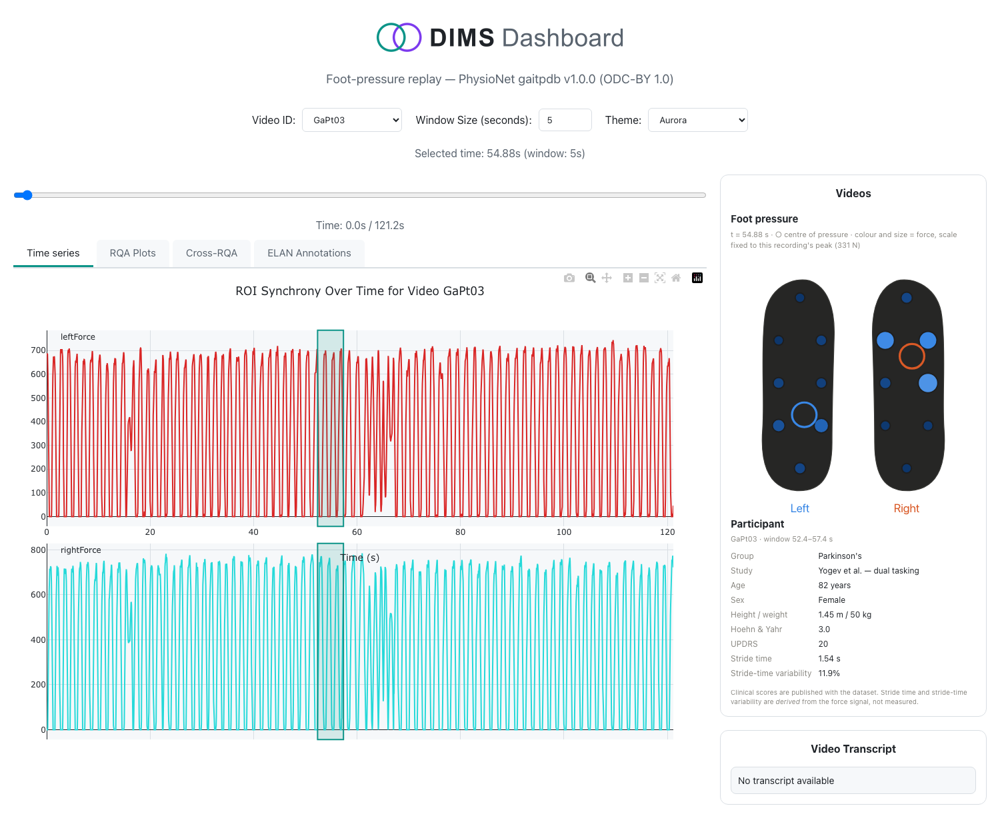
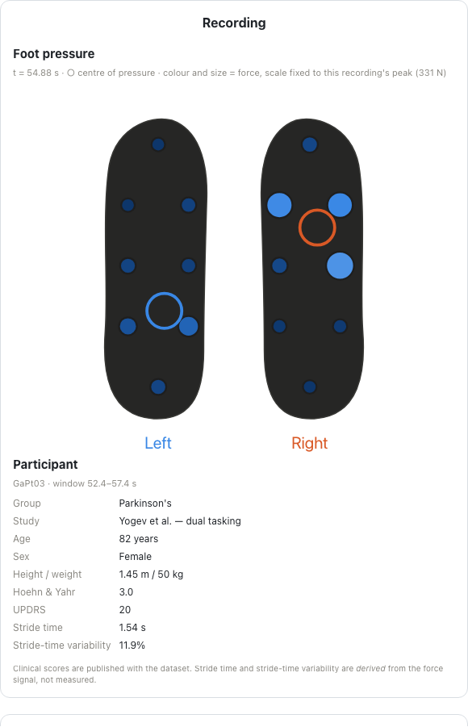
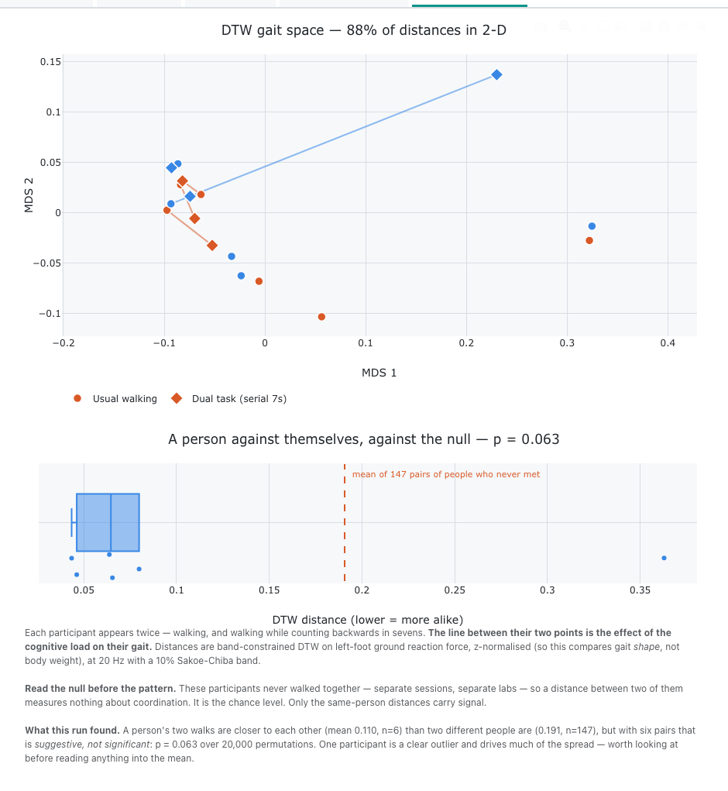

# DIMS: an outsider's evaluation

*GAIT-attempt, 2026-09-10. Written from
[FIELD-NOTES.md](FIELD-NOTES.md); every claim traces to a dated entry.
Walkthroughs: [no-code](TUTORIAL-NONCODER.md) · [terminal](TUTORIAL-CODER.md).*

**Who is speaking.** A researcher in embodied cognition working on gait dynamics
— foot-pressure recordings, 16 force sensors at 100 Hz, PhysioNet gaitpdb — whose
other studies use body-worn IMUs. I found DIMS through its GitHub organisation
and wanted one thing answered: **could my next study live in it?**

## Verdict

- **Yes.** DIMS runs a study with **no video at all**, which I could not
  establish from the documentation and which decides adoption for me.
- **The engineering is above the norm for research software.** The analysis
  warnings are the best I have seen in this space; the privacy model is a correct
  reading of how research data leaks; the tab contract let me replace a core
  component without editing the core.
- **The front door is locked.** The no-code path cannot be started from the
  published site — the two pages defer to each other and neither names a
  launcher. The wizard behind it is good.
- **Two defects appear only on unfamiliar data**, which is exactly what an
  outsider is for: a warning that fires on rounding, and a figure titled for the
  study the tab was first written for.
- **What DIMS says publicly is behind what DIMS is.** The site advertises v1.0.1
  against a v1.4.1 codebase and still quotes a figure the changelog retracted.

## 1 · Findings

| | Finding | Evidence | Filed |
|---|---|---|---|
| `BUG` | The builder's own fix-hint never runs. `__main__.py` docstring says `pip install "dims-network[builder]"`; line 16 raises `ModuleNotFoundError: No module named 'flask'` first. `project.py` does this correctly twice elsewhere. | before/after in PR | [**PR #18**](https://github.com/dims-network/dims/pull/18) |
| `BUG` | Window warning fires on sample-grid rounding, tolerance `1e-9` s. Reports **1.5 ms (0.0075 %)** as a shortening that makes DET and LAM incomparable — and `{:g}` vs `{:.4g}` render both numbers as `20`, so it says a value was changed to itself. **12/18** window reports affected; after the fix, **0/18**. | `length_requested_sec: 20.0`, `length_used_sec: 19.9985` | [**PR #19**](https://github.com/dims-network/dims/pull/19) |
| `BUG` | Every time-series figure titled "ROI Synchrony Over Time" — fNIRS leftover. Docs describe it accurately and say "Ignore it". |  | [**PR #20**](https://github.com/dims-network/dims/pull/20) |
| `DOC` | Site is v1.0.1 vs code v1.4.1; still quotes the "0.25" figure the v1.4.1 changelog says was withdrawn; `setup.html` omits `[builder]`; `tutorial.html` never names a launcher. Repo is right in **six** places — only the website is wrong. | `curl … \| grep 0.25` | [#21](https://github.com/dims-network/dims/issues/21) |
| `BUG` | `Segment (NaN s – NaN s)` before first click; 404 console noise for unclaimed optional assets; panel headings hardcoded to "Videos". | every fresh load | [#22](https://github.com/dims-network/dims/issues/22) |
| `FRICTION` | `dims-builder --help` starts the server; `serve.py --port` crashes. | — | [#23](https://github.com/dims-network/dims/issues/23) |

All three PRs pass the full suite (`418 passed, 2 skipped` with the new tests).

## 2 · Gaps and frictions, ranked by cost against benefit

**1 · Publish the launcher.** Highest ratio in the report. `run.command` already
exists and Finder runs `.command` files in Terminal, so the genuinely no-code
instruction — "double-click `run.command`" — needs no terminal at all. Cost: one
line above Step 1. Benefit: the no-code path stops being unreachable.

**2 · Generate the site from `docs/`.** Every stale claim on the website is
already correct in the repository. This is drift, not error, and it will recur.

**3 · Say that video is optional.** `getting-started.md` reads as though a
recording is a video with data attached. It is not — the core is timestamp-driven
and does not care. That fact is a selling point to a whole class of users
(audio-only corpora, mocap, force plates, EMG, eye-tracking, IMUs, and anyone
using Masked-Piper-style de-identification), and today you discover it by trying.

**4 · Run the pipeline on deliberately foreign data.** Both substantive bugs are
invisible from inside: the warning is only absurd when the sample rate is not the
usual one; the title is only wrong when the measure is not fNIRS. One non-native
dataset in CI would have caught both.

**5 · `PAYLOAD_VERSION` is duplicated across Python and JavaScript with nothing
checking they agree.** Not mine to report — `docs/reference/dims-api.md` says so
itself and calls it a defect. Worth a test.

## 3 · Ideas and extensions

**Done, in this evaluation.** The **feet in the video slot**: `updateVideos` is
overridden through the documented `DIMS.extendHost` seam so `#fullVideoContainer`
draws sixteen sensors sized and coloured by force with both centres of pressure,
and `#segmentVideoContainer` carries the participant panel — group, study, age,
sex, body, Hoehn & Yahr, UPDRS, stride time, stride-time variability. 173 lines
of study-local JS, no core edit.

The point is not the feet. It is that **a video component is a function from a
timestamp to a picture, and so is a pressure map** — and DIMS's playhead did not
have to be told the difference. That seam generalises to pose skeletons,
spectrograms and gaze heatmaps.

**Built: a DTW gait space** — `opt/step_dtw.py` + `tabs/dtw-tab.js` in the case
repo. DIMS asks *how much* two signals are coupled; DTW asks *how one must be
warped in time to match the other*. Each participant appears twice — walking, and
walking while counting backwards in sevens — and the line between their two
points is the effect of the load on their gait.

18 recordings, 153 pairs, 20 Hz, 10 % Sakoe-Chiba band. The 2-D embedding
explains **88.2 %** of the distances. A person under load sits closer to
themselves (**0.110**, n=6) than two people who never met (**0.191**, n=147) —
**p = 0.063** over 20 000 permutations, so *suggestive, not significant*, and one
participant (GaCo13) is a clear outlier driving much of the spread.

The null is not an afterthought here: these participants never walked together,
so a distance between two of them measures nothing about coordination — it *is*
the chance level, and it is the only defensible baseline this dataset offers.

**Where it belongs is itself a finding.** I was about to open a PR putting this
in the core. `contracts/step.md` says *"Most analyses are the second kind"* —
study-owned `opt/step_<id>.py` — and gives the test my analysis fails: its input
is the study's own upstream pipeline. So it runs through DIMS's own
`build_assets.py`, writing via `assets.resolve` and `results.write_payload`. **The
contract told an outsider not to contribute upstream, and it was right.** That is
a point in DIMS's favour, and it is why
[#24](https://github.com/dims-network/dims/issues/24) stays a question — whether
a *general* DTW step is wanted — rather than becoming a PR.

## 4 · Decisions I took

| Decision | Why | If you disagree |
|---|---|---|
| Claimed the dual-task contrast applied to my subjects | **Wrong.** `_10` is 404 for all six defaults; only 27 subjects (GaCo13–22, GaPt13–33) have it. Corrected by ingesting a cohort that does. | — |
| Made no claim about the *direction* of the dual-task effect | Variability rises for 2 of 6 and falls for 4. My own precondition was that it reproduce the known direction; it does not, at n=6. Both directions are in the literature. | — |
| Decimated 100 Hz → 25 Hz before export | recurrence is O(n²); 12 119 samples is a 147 M-cell matrix per pair. 25 Hz preserves every stride event (fastest feature ≈ 0.1 s). Decimation, not interpolation — an interpolated force is a number nobody measured. | raise `TARGET_HZ` in `dims_adapter/export.py`; the analyses re-reduce for the browser anyway, so the cost is CPU |
| Paired left foot against right foot for cross-RQA | in a gait recording the two feet *are* the coupled pair | — |
| Feet in the *full* slot, demographics in the *segment* slot | the feet are the thing that replaces the video; the participant panel is context beside it | swap in `feet-video.js` |
| Retitled "Videos"/"Video Transcript" in **my** study only | a study-local patch to a core scaffold assumption, not a core change | filed as part of #22 |
| Did not read your local `DIMS_ALL/dims` checkout | outsider discipline; it may hold unpublished work | — |
| Restored your conda env | `pip install -e ./dims`, run verbatim from `setup.html`, uninstalled the `dims-network` already in your conda base. Put back, editable from your own checkout. **The underlying finding: `setup.html` has no venv step.** | — |

## 5 · Adoption verdict

**Would I put my next IMU study in DIMS?** Provisionally yes, with one thing to
establish first.

| Requirement | Status |
|---|---|
| Many numeric channels, high rate, **no camera** | **Met.** Proven end to end. |
| Session and participant metadata that survives | Met via `config.json` + study-local assets |
| ELAN interoperability | Shipped; **not yet tested by me** (E5 outstanding) |
| Motion-BIDS ingest or export | Absent. Would shorten my pipeline; not a blocker |
| **Several sensors, several independent clocks** | **Unknown — the blocker.** |

The last row is the one that decides it. Body-worn IMUs start at different
moments and drift apart; alignment is the whole problem, and your own network has
been bitten by it (`xdf_desync_problem_testing`). Everything I ran assumed one
shared clock, because gaitpdb has one. **Can a DIMS study hold two streams with
independent time bases, or does the shared timeline assume they are already
aligned?** I planned an experiment for this (E7 in my notes) and did not reach it.
That, not any bug in this report, is what I would want answered next.
