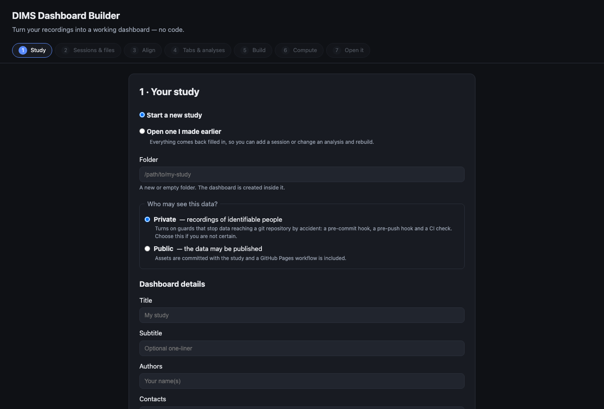

# DIMS tutorial — the no-code path

*Walkthrough report, GAIT-attempt. Written 2026-09-10, before reading the source
for any purpose other than diagnosing a failure I could not get past. Followed
from <https://dims-network.github.io/tutorial.html> as a cold read.*

## Verdict

- **The wizard is good.** It is a genuine seven-step no-code builder, it explains
  itself well, and its privacy handling — Private vs Public, with a pre-commit
  hook, a pre-push hook and a CI check to keep recordings of identifiable people
  out of git — is better than most research software I have installed.
- **A non-coder cannot reach it.** Following the published pages only, the path
  dead-ends before step 1: nothing tells you how to start the wizard.
- **The install command on the website is the wrong one.** `setup.html` says
  `pip install -e ./dims`; the builder needs the `[builder]` extra. The
  repository's own README has this right — the *website* does not.
- **The failure is a raw traceback**, and the sentence that would fix it sits in
  a docstring that never executes.
- **One-click launchers already exist** (`run.command`, `run.sh`, `run.bat`) and
  are documented only in the CLI reference — the one page a non-coder will never
  open. The fix here is mostly *pointing at work already done*.

## What happened

| Time | Step | Outcome |
|---|---|---|
| 03:44 | Land on `index.html`, follow "Tutorial" | Fine. Clear claims, clear nav. |
| 03:45 | Read prerequisites: Python 3.10–3.12, "clone it, or download the ZIP" | "Clone" is unglossed on a no-code page. |
| 03:45 | Look for how to open the wizard | **Not present.** Tutorial jumps straight to "Step 1 · Your study". |
| 03:45 | Check `setup.html` for the launch step | It defers back: "if you would rather click through a wizard, the tutorial does that". The two pages point at each other. |
| 03:46 | *(rule broken — see below)* clone + `pip install -e ./dims` as `setup.html` says | Installs. Exit 0. Looks like success. |
| 03:48 | `dims-builder` | **`ModuleNotFoundError: No module named 'flask'`** |
| 03:49 | Read `pyproject.toml`, find the `[builder]` extra, install it | Wizard starts, serves at `127.0.0.1:5000`. 2 s. |

Time to first render: **5 minutes** — against the page's estimate of "about 10
minutes", so the estimate is honest. But that 5 minutes required reading
`pyproject.toml` and a traceback. **On the documented path the time is
unbounded**, because nothing has visibly failed and there is no error to search
for.

I set myself a rule before starting: on this path I may not open the source, use
a terminal to unblock myself, or guess a command from experience. **I broke it at
03:46**, and that is the finding. Everything after that line is a programmer
rescuing himself with knowledge the documentation did not provide. A reader who
came for the no-code path has no equivalent move.

## The three blockers

**1 — The no-code path has no start button.** `tutorial.html` never names
`dims-builder`, `run.command`, or any other way in. *Fix: one line above Step 1
naming the launcher and what success looks like.* Given `run.command` exists and
"Finder runs .command files in Terminal", the honest no-code instruction is
"double-click `run.command` in `apps/builder/`" — which needs no terminal at all.

**2 — The published install command omits the extra.** Site says
`pip install -e ./dims`; the repo's README says `pip install -e './dims[builder]'`.
Six places in the repo get this right. The website is stale — consistent with it
also advertising **v1.0.1** when the code is **v1.4.1**, and still quoting a
coherence figure the v1.4.1 changelog says was withdrawn as wrong.
*Fix: regenerate the site from the same source as `docs/`.*

**3 — The actionable hint never runs.** `apps/builder/dims_builder/__main__.py`
opens with a docstring saying `pip install "dims-network[builder]"` — but line 16,
`from dims_builder.server import create_app`, raises `ModuleNotFoundError` first.
The guidance exists and is unreachable. *Fix: guard that import and print the
line the docstring already contains.* Four lines. This is the single highest
ratio of benefit to effort I found.

Note in the project's favour: `dims_builder/project.py` **does** do this properly
in two other places (`Reinstall with: pip install 'dims-network[builder]'`), so
the intent is established — the entry point is just missing it.

## What the wizard looks like once reached

Seven steps: Study → Sessions & files → Align → Tabs & analyses → Build →
Compute → Open it. Drag-and-drop file typing by name pattern
(`session1_headSpeed.csv`, `session1_transcript.json`, `session1.eaf`), an
example study for people with no data yet, and an honest warning that
cross-wavelet "can turn step 6 from a minute into an afternoon".

This is a well-made thing behind a door that is locked from the outside.
